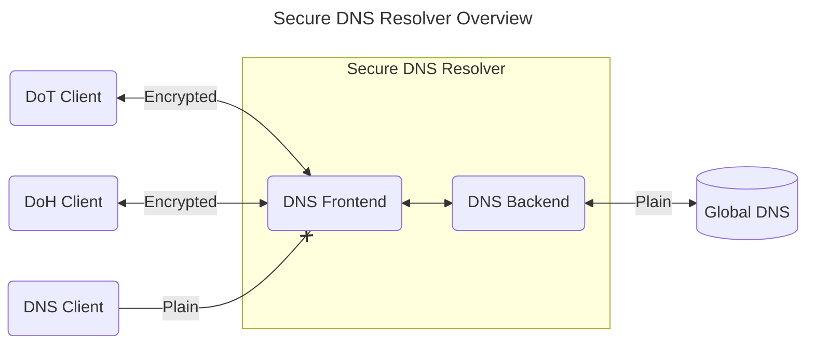
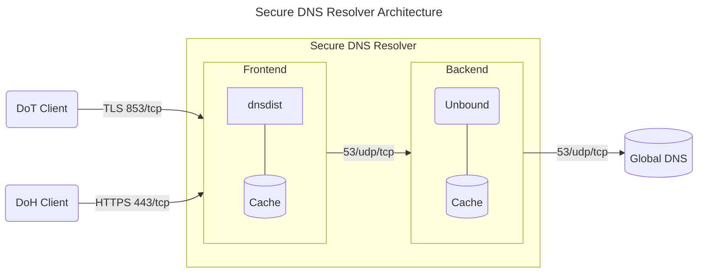

# System Architecture

## Overview

High level architecture of the DNS resolver configuration:

## Detailed Setup

The DNS resolver architecture is divided into two parts. The user _DNS Frontend_ is [dnsdist](https://dnsdist.org/) and
provides. The frontend listens on port 443/tcp for DoH and port 853/tcp for DoT. The _DNS Backend_, responsible for
resolving the user queries within the domain system, is [unbound](https://www.nlnetlabs.nl/projects/unbound/about/).

Unencrypted DNS queries over 53/udp/tcp are not supported.

### DNS Frontend

The frontend accepts client connections, validates DNS queries and forward them to the backend for name resolution, if
the cache does not already provide an answer.

- Handles TLS encryption and Let's Encrypt certificates
- Enforce rate limits to increase availability for all users

### DNS Backend

The backend is only reachable by the _dnsdist_ frontend. If the answer to a query is not already cached it is resolved
by querying the global domain name system (DNS).

- Prefetching cache to reduced latency
- DNSSEC validation
- 0x20-encoded random bits in query names to harden against spoofing attacks (see `use-caps-for-id`)
- Query minimisation (qname-minimisation)
