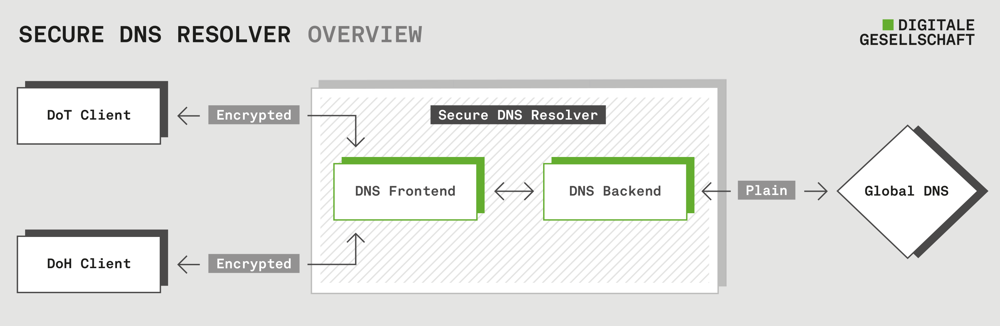

# Secure DNS Resolver

Information, configuration files and _how tos_ about the public secure DNS resolvers operated by the Digital Society Switzerland.

The Digital Society Switzerland runs publicly available DNS-over-HTTPS (DoH) and DNS-over-TLS (DoT) DNS resolver systems.

This repository contains:

- [Configuration files](configuration-files) of our production systems. Anyone interested in our setup can review our production configuration or run its own setup based on our configuration files. You may also check out our [system architecture](ARCHITECTURE.md).
- [How tos](howtos) to configure encrypted DNS on various devices. This allows people to use our secure DNS resolvers.

Also, checkout our [website](https://www.digitale-gesellschaft.ch/dns/) and the [FAQ](FAQ.md).

# How to use our DNS resolvers

To use our DNS resolvers on your DoH or DoT capable client simply configure:

| Protocol             | Address                                                                                          |
| -------------------- | ------------------------------------------------------------------------------------------------ |
| DNS-over-HTTPS (DoH) | `https://dns.digitale-gesellschaft.ch/dns-query`                                                 |
| DNS-over-TLS (DoT)   | `dns.digitale-gesellschaft.ch` if you need to specify also a Port use the DoT default Port `853` |

For specific configuration check out our [How-Tos](howtos).

**Note:** We deliberately do not operate unencrypted DNS service over Port 53.

# Contribution

Contributions to this project are very welcome. If you like to contribute, check-out [CONTRIBUTION](CONTRIBUTION.md) for more information.

Some ideas where help is appreciated:

- Configuration how tos: Update existing guides, translate them in other languages and add new how tos.
- Ansible config review: If you know Ansible well you may review our configuration and suggest improvements.
- DNS config: If you know

# Similar Services

You may also try the DNS resolvers of similar organisations and setups:

- [Applied Privacy](https://applied-privacy.net/services/dns/) operates public DNS resolvers in Austria.
- [Quad9](https://www.quad9.net/) operates public DNS resolvers around the world.

# License

This project is licensed under [Creative Commons BY-SA](https://creativecommons.org/licenses/by-sa/4.0/deed.en)
