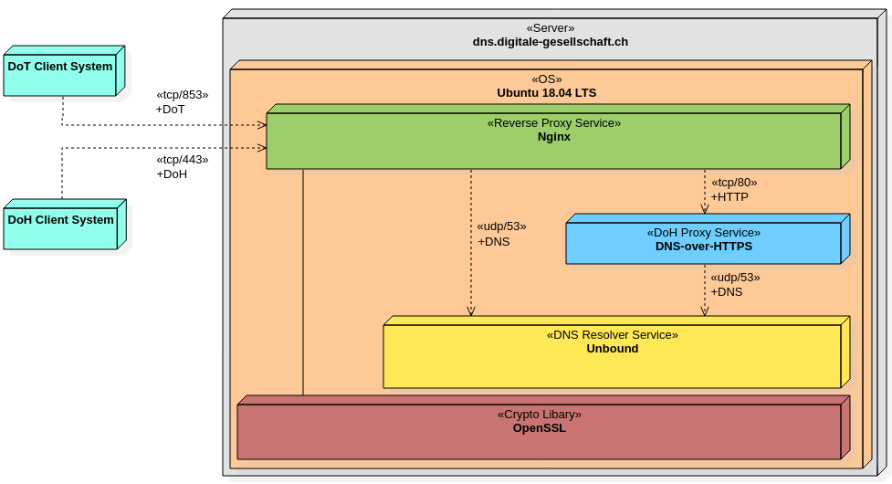

# DNS-Resolver
Configuration files of our DoT and DoH servers

Digitale Gesellschaft runs two publicly available DoH and DoT name resolver systems. Our live configuration is publicly available in this repository. Feel free to copy it and run your own DoH or DoT server.

Any suggestions or questions about this configuration? Feel free to contact us!

More information can be found [here](https://www.digitale-gesellschaft.ch/dns/) (German only).

## Overview

Our two servers have an identical setup. Here is a deployment diagram as an overview.

- Nginx is our reverse proxy which handles connections on port 853/tcp and port 443/tcp. All crypto and certificate configurations are done here.
- [DNS-over-HTTPS](https://github.com/m13253/dns-over-https) is responsible for translating HTTP to DNS and vice versa.
- Unbound is our DNS resolver, all name to IP translation work is done here.

