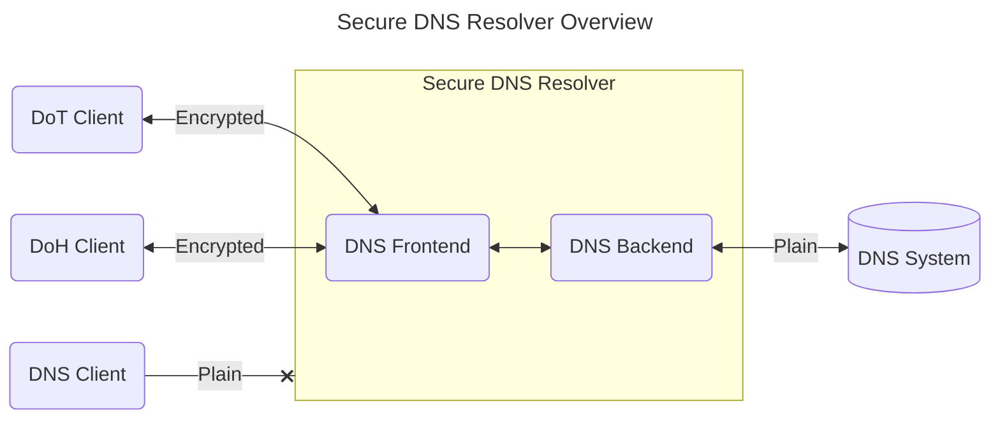
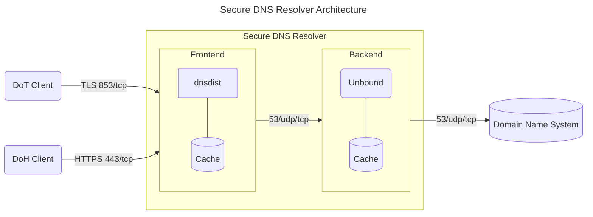

# Secure DNS Resolver Architecture and Configuration

Ansible managed configuration files for DNS-over-HTTPS (DoH) and DNS-over-TLS (DoT) DNS resolver.

High level architecture of the DNS resolver configuration:



## Architecture

The DNS resolver architecture is divided into two parts. The user _DNS Frontend_ is [dnsdist](https://dnsdist.org/) and provides. The frontend listens on port 443/tcp for DoH and port 853/tcp for DoT. The _DNS Backend_, responsible for resolving the user queries within the domain system, is [unbound](https://www.nlnetlabs.nl/projects/unbound/about/).

Unencrypted DNS queries over 53/udp/tcp are not supported.



## Quick Start (Staging)

Apply this configuration to local virtual staging systems.

1. Setup two virtual Ubuntu servers with SSH access.
2. TODO

## Configuration

Quick start from within `configuration-files/` directory:

```shell
ansible-playbook --ask-become-pass --ask-vault-pass resolver.yml --check
```

Dry run: Remove `--check` once the output looks like the expectations.

A linux user account with SSH access is required on the server.

Note: Due to obvious security and privacy reasons, this repository is not completely self-contained. Sensitive files and information are not part of this repository. Check the 'Missing Files' section to get an idea what you might need for your own setup.

### Run the setup

Prerequisites: Ansible is installed on your local system and our terminal is in `configuration-files/`.

Note: Initial setup requires a manual Let's Encrypt certificate creation. After first run one must create the certificates manually:

0. Run the playbook
      ```
      ansible-playbook  --ask-become-pass --ask-vault-pass resolver.yml
      ```
1. Login to the server via SSH and create TLS certificates manually.

      ```
      on res3:
      sudo certbot certonly --config /etc/letsencrypt/cli.ini --key-type ecdsa --cert-name res3.digitale-gesellschaft.ch.ecdsa -d res3.digitale-gesellschaft.ch --dry-run

      remove --dry-run once there are no errors

      on every server:
      sudo certbot certonly --config /etc/letsencrypt/cli.ini --key-type ecdsa --cert-name dns.digitale-gesellschaft.ch.ecdsa -d dns.digitale-gesellschaft.ch -d dns1.digitale-gesellschaft.ch -d dns2.digitale-gesellschaft.ch --dry-run

      remove --dry-run once there are no errors
      ```

2. Rerun the playbook again
      ```
      ansible-playbook  --ask-become-pass --ask-vault-pass resolver.yml
      ```

After this process the certificates should be renewed automatically and any further run of the playbook should not change anything on the server configuration.

#### Run specific parts

Instead of running the whole playbook run only single parts by adding `--tags` e.g. `--tags "firewall"`

Run by role:

- `backend`
- `base`
- `frontend`
- `highavailability`
- `monitoring`
- `webserver`

Run by topic:

- `firewall`
- `ssh`

## Ansible Configuration Details

[Ansible](https://www.ansible.com/) allows to specify the configuration in a declarative way. Combined with its idempotence properties it allows to automate the setup.

The playbook `resolver.yml` contains the whole setup.

### Roles

| Role             | Description                                                                                        |
| ---------------- | -------------------------------------------------------------------------------------------------- |
| base             | Basic server setup, user configuration, tool and package installation for basic server management. |
| dns-backend      | Backend DNS resolver configuration, communicates with the domain name system (the Internet).       |
| dns-frontend     | Frontend DNS resolver configuration, encrypted communicates with the users who use our service.    |
| highavailability |                                                                                                    |
| monitoring       | The server-side and third-party-side monitoring of our DNS resolvers.                              |
| webserver        | Responsible for creating Let's Encrypt certificates and reverse proxy for monitoring purposes      |

### Variables

| Variablename                       | Description                                                |
| ---------------------------------- | ---------------------------------------------------------- |
| `dg4_dns`                          | IP v4 default gateway                                      |
| `dg6_dns`                          | IP v6 default gateway                                      |
| `dnsdist_nof_thread_doh_per_ip`    | Number of dnsdist threads per DoH IP                       |
| `dnsdist_nof_thread_dot_per_ip`    | Number of dnsdist threads per DoT IP                       |
| `dnsdist_nof_thread_upstream`      | Number of dnsdist upstream threads                         |
| `domain`                           | Domain of this resolver                                    |
| `host_public`                      | Hostname of this resolver                                  |
| `if_loopback`                      | Name of the loopback interface on this server              |
| `if_primary`                       | Name of the primary interface on this server               |
| `ip4_dns1`                         | Public IP v4 address of resolver 1                         |
| `ip4_dns2`                         | Public IP v4 address of resolver 2                         |
| `ip4_vip_dns1`                     | Public IP v4 address of resolver 1                         |
| `ip4_vip_dns2`                     | Public IP v4 address of resolver 2                         |
| `ip4_vrrp1`                        | Internal VRRP (load balancing) IP v4 address of resolver 1 |
| `ip4_vrrp2`                        | Internal VRRP (load balancing) IP v4 address of resolver 2 |
| `ip6_dns1`                         | Public IP v6 address of resolver 1                         |
| `ip6_dns2`                         | Public IP v6 address of resolver 2                         |
| `ip6_vip_dns1`                     | Public IP v6 address of resolver 1                         |
| `ip6_vip_dns2`                     | Public IP v6 address of resolver 2                         |
| `ip6_vrrp1`                        | Internal VRRP (load balancing) IP v6 address of resolver 1 |
| `ip6_vrrp2`                        | Internal VRRP (load balancing) IP v6 address of resolver 2 |
| `ip_localhost`                     | IP v4 of the loopback interface on this server             |
| `netmask4_dns_cidr`                | Netmask of the public IP v4                                |
| `netmask4_vrrp1_cidr`              | Netmask of the internal VRRP (load balancing) IP v4        |
| `netmask6_dns_cidr`                | Netmask of the public IP v6                                |
| `netmask6_vrrp1_cidr`              | Netmask of the internal VRRP (load balancing) IP v6        |
| `network_port_ssh`                 | Custom SSH tcp port                                        |
| `node_exporter_web_listen_address` | Node exporter listening host and port                      |
| `nof_cpu`                          | Number of CPUs of this resolver                            |
| `unbound_msg_cache_size`           |                                                            |
| `unbound_nof_slabs`                |                                                            |
| `unbound_nof_thread`               | Number of Unbound threads                                  |
| `unbound_num_queries_per_thread`   |                                                            |
| `unbound_outgoing_range`           |                                                            |
| `unbound_rrset_cache_size`         |                                                            |
| `unbound_so_rcvbuf`                |                                                            |
| `unbound_so_sndbuf`                |                                                            |
| `vip_interfaces`                   | List of virtual IP v4 and v6 addresses                     |

### Missing Files

We do not keep sensitive information in this repository. So every one has a chance to setup her/his own setup we provide additional information to bring the configuraiton in this repository up.

#### SSH Config

In the `inventory.yml` file the two systems `dns1` and `dns2` are referred. In order Ansible knows these host systems they need to be in the SSH configuration `~/.ssh/config` file e.g.:

```
# ~/.ssh/config

host dns1
User jdoe
Hostname <ip>
Port <port>

host dns2
User jdoe
Hostname <ip>
Port <port>
```

#### SSH Users

Task to create an additional SSH user on the server.

```
# configuration-files/roles/base/tasks/users/jdoe.yml

---

- name: users | jdoe | create group
  group:
    name: jdoe
    state: present

- name: users | jdoe | create user
  user:
    name: jdoe
    group: jdoe
    groups: adm,sudo
    state: present
    comment: "j doe"
    shell: /bin/bash

- name: users | jdoe | add ssh public key
  authorized_key:
    user: jdoe
    key: "ssh-public key here"
```

#### Ansible Vault

Contains secrets and passphrases in key-values pairs and is located in `configuration-files/group_vars/vault.yml`.

```
# configuration-files/group_vars/vault.yml

dnsdist_control_interface_key:
dnsdist_webserver_api_key:
dnsdist_webserver_password:
keepalived_dns42_4:
keepalived_dns42_6:
keepalived_dns43_4:
keepalived_dns43_6:
statisitcs_user:
statistics_password:
```
