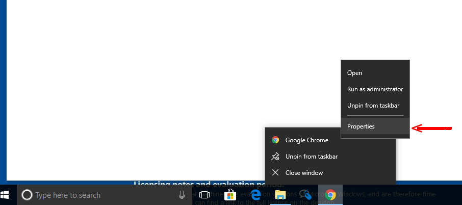

# Chrome mit DoH

## Experten

Diese Konfigurationsvorschläge richten sich an sehr erfahrene Personen. Es muss zum Teil Drittsoftware nach installiert werden oder Einstellungen in den Konfigurationsdateien angepasst werden.

Die aktuelle Version unterstützt DoH unter Windows. Um Chrome mit unseren DoH-Resolvern zu verwenden, muss das Programm mit folgendem Startup-Parameter aufgerufen werden:

    --profile-directory=Default --enable-features="dns-over-https<DoHTrial" --force-fieldtrials="DoHTrial/Group1" --force-fieldtrial-params="DoHTrial.Group1:server/https%3A%2F%2185.95.218.42%2Fdns-query/method/POST

