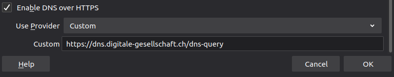

# Firefox mit DoH

Mozilla hat DoH ab Firefox Version 62 integriert.

## Grundeinstellung

Diese Einstellungen sind alle per grafischem User Interface (GUI) durchführbar und können relativ einfach und schnell
konfiguriert werden.

1. Öffne die _Einstellungen_ via _Extras_ im Menü.
2. Scrolle im Bereich _Allgemein_ ganz nach unten und wähle in der Sektion Verbindungs-Einstellungen den Knopf
   _Einstellungen_.
3. Aktiviere _DNS über HTTPS aktivieren_ und wähle Benutzerdefiniert. Im neuen Feld nun URL
   `https://dns.digitale-gesellschaft.ch/dns-query` eingeben.

## Experten

Diese Konfigurationsvorschläge richten sich an sehr erfahrene Personen. Es muss zum Teil Drittsoftware nach installiert
werden oder Einstellungen in den Konfigurationsdateien angepasst werden.

Firefox kann DoH im Strict Mode verwenden. Dazu sind Anpassungen in about:config nötig:

- network.trr.bootstrapAddress = 185.95.218.42
- network.trr.custom_uri = https://dns.digitale-gesellschaft.ch/dns-query
- network.trr.mode = 3

Die verschiedenen Modi von network.trr.mode:

- 3: Verwende nur DoH (eine Bootstrap IP muss angegeben werden (185.95.218.42, 185.95.218.43, 2a05:fc84::42 oder 2a05:
  fc84::43) ‒ es kann nur eine IP hinterlegt werden)
- 2 (default Einstellung): DoH wird präferiert aber reguläres DNS ist auch möglich (fallback)
- 1: FF wählt zwischen DoH und DNS (das schnellere)
