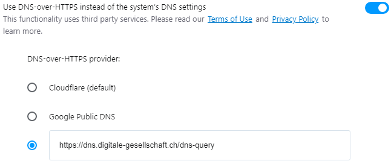

# Opera mit DoH

## Grundeinstellung

  0. Öffne die _Browser Einstellungen_ oben rechts oder gebe `opera://settings` in die URL-Zeile ein.
  0. Scrolle nach unten bis zur Kategorie System.
  0. Aktiviere _DNS über HTTPS aktivieren_ und wähle _Benutzerdefiniert_. Im neuen Feld nun URL `https://dns.digitale-gesellschaft.ch/dns-query` eingeben.

