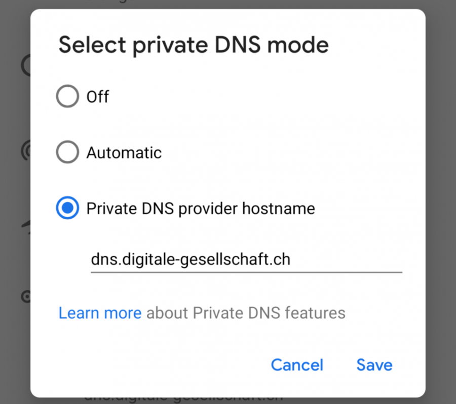

# Android mit DoT

Google bietet DoT ab Version 9 (Pie) über die Netzwerkeinstellungen an. Lineage OS bietet DoT ab Version 16 an.

## Grundeinstellung

0. Öffne die _Einstellungen_ im Appmenu
1. Wähle _Netzwerk & Internet_ und dann _Erweitert_
2. Öffne die Einstellung Private DNS und trage unter Private DNS provider hostname `dns.digitale-gesellschaft.ch` ein.

