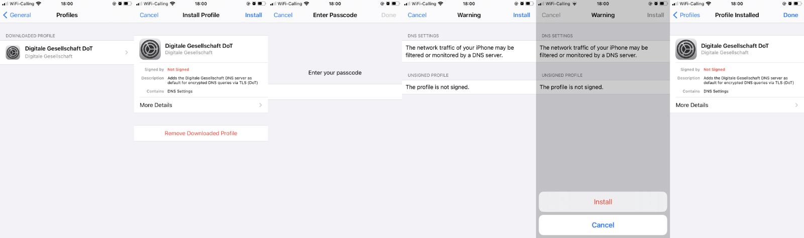

# iOS mit DoT oder DoH

Seit iOS 14 oder macOS 11 unterstützen Apple-Geräte das Setzen der System-weiten DNS Server via Profile. Dabei sind
unserer Profile so definiert, dass sie sämtliche DNS Anfrage unabhängig vom Netzwerk (WiFi oder mobiles Netz) und
verschlüsselt an unsere DNS Server leiten.

- [DNS over TLS (DoT)](conf/digiges-dns-tls.mobileconfig)
- [DNS over HTTPS (DoH)](conf/digiges-dns-https.mobileconfig)

:warning: Installiere nur eines der beiden Profile gleichzeitig.

## Installation

1. Lade das gewählte Profil auf dein iOS oder macOS-Gerät herunter
2. Öffne die Einstellungen und geh zu _Allgemein_, _Profile_
3. Klicke auf das heruntergeladene Profil _Digitale Gesellschaft DoT/DoH_ und wähle _Installieren_
4. Gib dein Geräte-Passwort ein
5. In der nun erscheinenden Warnung klicke nochmals auf _Installieren_ und bestätige deine Auswahl

## Alternative via DNSCloak App

Die App [DNSCloak](https://apps.apple.com/us/app/dnscloak-secure-dns-client/id1452162351) bietet DoH für Apple
iOS-Geräte an. Unsere Server sind in den Standardeinstellungen zu finden.

1. Lade die App herunter und installiere sie
2. Suche in der Serversuche nach _Digitale_
3. Aktiviere unsere Server über den Knopf _Use this server_
