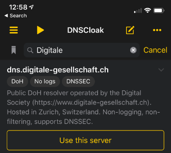

# iOS mit DoH via DNSCloak App

Die App [DNSCloak](https://apps.apple.com/us/app/dnscloak-secure-dns-client/id1452162351) bietet DoH für Apple iOS-Geräte an. Unsere Server sind in den Standardeinstellungen zu finden.

## Grundeinstellung

  0. App herunterladen und installieren.
  0. In der Serversuche nach _Digitale_ suchen und
  0. unsere Server über den Knopf _Use this server_ aktivieren.

