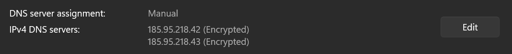
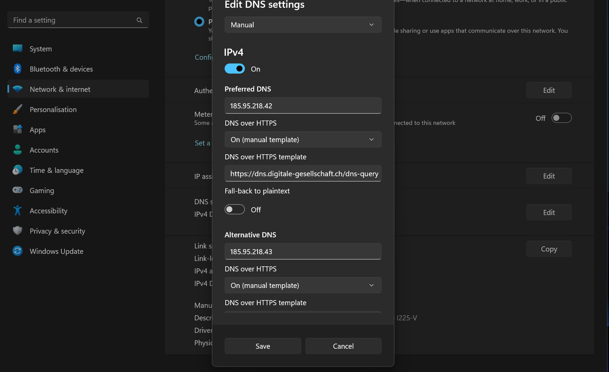

# Windows 11 mit DoH

Microsoft bietet DoH über die Netzwerkeinstellungen an.

## Grundeinstellung

1. Öffne die _Einstellungen_ in der Windowssuche
2. Wähle _Netzwerk & Internet_ und dann _WiFi_ oder _Ethernet_ (jenach Verbindung)
3. Gehe zu _DNS Server Zuweisung_ und klicke auf _Bearbeiten_

4. Aktiviere IPv4 und/oder IPv6 und trage die Infos gemäss Bild (siehe am Ende für Copy&Paste) ein:

5. Klicke _Speichern_

## Informationen für die Konfiguration

**IPv4 Adressen**
- `185.95.218.42`
- `185.95.218.43`

**IPv6 Adressen**
- `2a05:fc84::42`
- `2a05:fc84::43`

**DNS über HTTPS Template Adresse**
- DoH: `https://dns.digitale-gesellschaft.ch/dns-query`

### Sonstiges

_Fall-back to plaintext_ sollte deaktiviert bleiben, damit der Datenverkehr immer verschlüsselt bleibt.