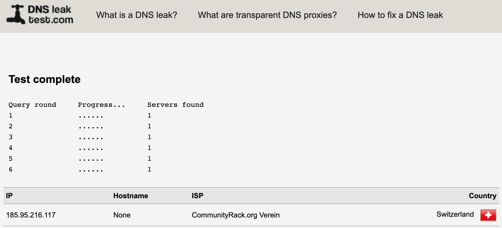

# Pi-hole DNS (Docker) mit DoT und DoH

> :warning: **Für Experten** :warning:
>
>Diese Konfigurationsvorschläge richten sich an sehr erfahrene Personen mit Dockererfahrung. Es muss zum Teil Drittsoftware nach installiert werden oder Einstellungen in den Konfigurationsdateien angepasst werden.

Der DNS-Resolver Pi-hole wird mit DoT und DoH als Docker Container ausgeliefert. Die folgende Anleitung basiert auf dem [Docker Container von Testasi](https://github.com/testdasi/pihole-dot-doh), welche vom [offiziellen Pi-hole Container](https://github.com/pi-hole/docker-pi-hole) ableitet und die zusätzlichen Abhängigkeiten cloudflared (DoH) und stubby (DoT) nachinstalliert.

Der Docker Container gibt es aktuell für die zwei Plattformen:
- linux/arm/v7 (z.B. Raspberry Pi 3/4 u.s.w.)
- linux/amd64 (z.B. Debian)

## Voraussetzung
- Docker

## Anleitung
1. Korrektes Docker Image entsprechend Plattform herunterladen.
    ```bash
    # Für ARM (z.B. Raspberry Pi 3/4)
    sudo docker pull testdasi/pihole-dot-doh:stable-rpi4

    # Für Linux AMD64
    sudo docker pull testdasi/pihole-dot-doh:stable-amd64
    ```

2. Docker Container erstellen.

   Wichtig: Die Einträge `WEBPASSWORD` und `ServerIP` anpassen, sowie den gewünschten Docker Container entsprechend der Plattform (siehe Punkt 1) ersetzen, z.B. anstatt `testdasi/pihole-dot-doh:stable-rpi4`, `testdasi/pihole-dot-doh:stable-amd64`.

   ```bash
   sudo docker run -d \
    --name='pihole-dot-doh' \
    --cap-add=NET_ADMIN \
    --restart=unless-stopped \
    --net='bridge' \
    --hostname='pihole-dns'\
    -e TZ="Europe/Zuerich" \
    -e HOST_OS="Unraid" \
    -v '/mnt/user/appdata/pihole-dot-doh/pihole/':'/etc/pihole/':'rw' \
    -v '/mnt/user/appdata/pihole-dot-doh/dnsmasq.d/':'/etc/dnsmasq.d/':'rw' \
    -v '/mnt/user/appdata/pihole-dot-doh/config/':'/config':'rw' \
    -e 'DNS1'='127.1.1.1#5153' \
    -e 'DNS2'='127.2.2.2#5253' \
    -e 'TZ'='Europe/Zuerich' \
    -e 'WEBPASSWORD'='YourPassword' \
    -e 'INTERFACE'='br0' \
    -e 'ServerIP'='192.168.1.3' \
    -e 'ServerIPv6'='' \
    -e 'IPv6'='False' \
    -e 'DNSMASQ_LISTENING'='all' \
    -p '53:53/tcp' \
    -p '53:53/udp' \
    -p '67:67/udp' \
    -p '80:80/tcp' \
    -p '443:443/tcp' \
    'testdasi/pihole-dot-doh:stable-rpi4'
    ```
3. Docker Container anhalten.
    ```bash
    sudo docker stop pihole-dot-doh
    ```
4. Konfigurationsdaten anpassen.
    cloudflared.yml Datei öffnen für *DoH* einzurichten.
    ```
    sudo nano /mnt/user/appdata/pihole-dot-doh/config/cloudflared.yml
    ```

    `proxy-dns-upstream` Eintrag anpassen und `proxy-dns-bootstrap` Eintrag erstellen
    ```YAML
    proxy-dns-upstream:
    - https://dns.digitale-gesellschaft.ch/dns-query
    proxy-dns-bootstrap:
    ## dns.digitale-gesellschaft.ch
    - https://185.95.218.42/dns-query
    - https://185.95.218.43/dns-query
    ```

    stubby.yml Datei öffnen für *DoT* einzurichten.  
    ```bash
    sudo nano /mnt/user/appdata/pihole-dot-doh/config/stubby.yml
    ```

    Google Server auskommentieren.
    ```YAML
    ...
    ####### IPv4 addresses ######
    ### Anycast services ###
    ....
    ## Google
    #- address_data: 8.8.8.8
    #    tls_auth_name: "dns.google"
    #- address_data: 8.8.4.4
    #    tls_auth_name: "dns.google"
    ```

    DigitaleGesellschaft DNS Server unterhalb von auskommentierten Googlee Servern eintragen.
    ```YAML
    ...
    - address_data: 185.95.218.42
        tls_auth_name: "dns.digitale-gesellschaft.ch"
    - address_data: 185.95.218.43
        tls_auth_name: "dns.digitale-gesellschaft.ch"
    - address_data: 2a05:fc84::42
        tls_auth_name: "dns.digitale-gesellschaft.ch"
    - address_data: 2a05:fc84::43 
        tls_auth_name: "dns.digitale-gesellschaft.ch"
    ```
5. Container wieder starten
    ```bash
    sudo docker start pihole-dot-doh
    ```
6. DNS Anfragen auf die IP-Adresse des Docker Containers umleiten.

   Dafür musst du auf deinem Router den DNS Server einstellen, damit alle deine Rechner in deinem Netz darüber laufen.

   Falls dein Router diese Einstellung nicht hat, kann du den DHCP Server des Raspberry Pis verwenden und diesen des Routers deaktivieren. Somit wird automatisch die pi-hole als DNS verwendet.
7. Testen der DNS Einstellungen.
    Auf [DNS leak test](https://dnsleaktest.com) den erweiterten Test durchführen. Anschliessend sollte anstelle deines vorherigen DNS Servers unser DNS sichtbar sein.
    

