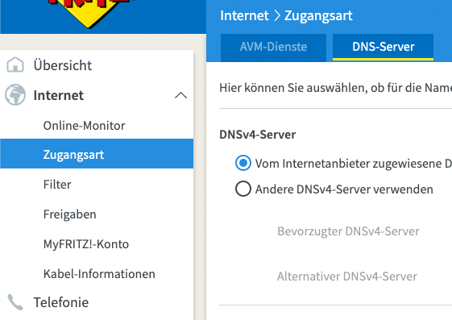
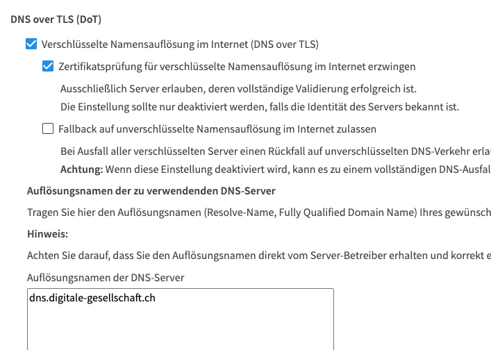

# Fritz.box

Um auf der Fritz.box DoT oder DoH zu konfigurieren, loggen Sie sich in ihre Fritz.box ein und gehen Sie zum Reiter "Internet" und dann "Zugangsart" (Abbildung 1). Anschließend öffnen Sie den Tab "DNS-Server". 

Nun suchen Sie weiter unten nach der Einstellung "DNS over TLS (DoT)", aktivieren diese, setzen eine persönliche Konfiguration und tragen den DNS Server der Digitalen Gesellschaft im Textfeld ein.

