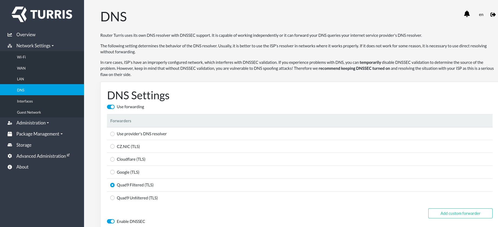
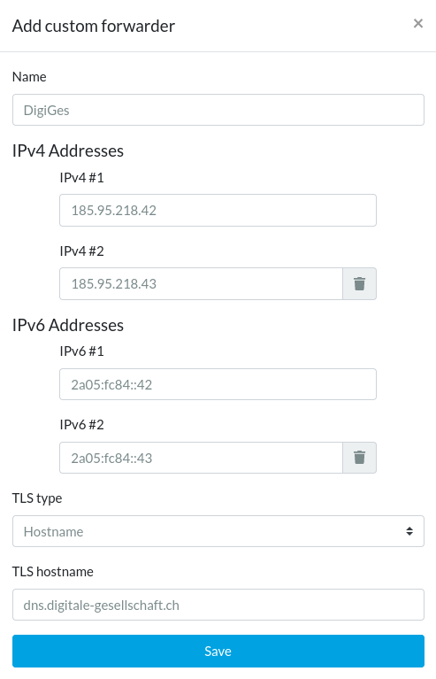

# Turris Omnia mit DoT

1. Menü unter Turris-Logo > `Network Settings` > `DNS`
   

2. Unten rechts auf `Add custom forwarder` klicken und [DigiGes Konfiguration](../../README.md) eingeben. Unter `TLS type` `Hostname` auswählen und bei `TLS hostname` den Port weglassen (`dns.digitale-gesellschaft.ch`). Dann speichern.
   

3. Auf der DNS-Seite den neuen Eintrag für den DigiGes-DNS auswählen und wieder speichern.
   

4. Unten auf der DNS-Seite den `Connection Test` durchführen. Zwei grüne Haken bei `DNS` und `DNSSEC` sollten erscheinen. Falls der `DNSSEC`-Test fehlschlägt, sicherstellen, dass `DNSSEC` oben aktiviert ist.

Weitere Details finden sich in der [offiziellen Dokumentation](https://docs.turris.cz/basics/reforis/dns/reforis-dns/).
